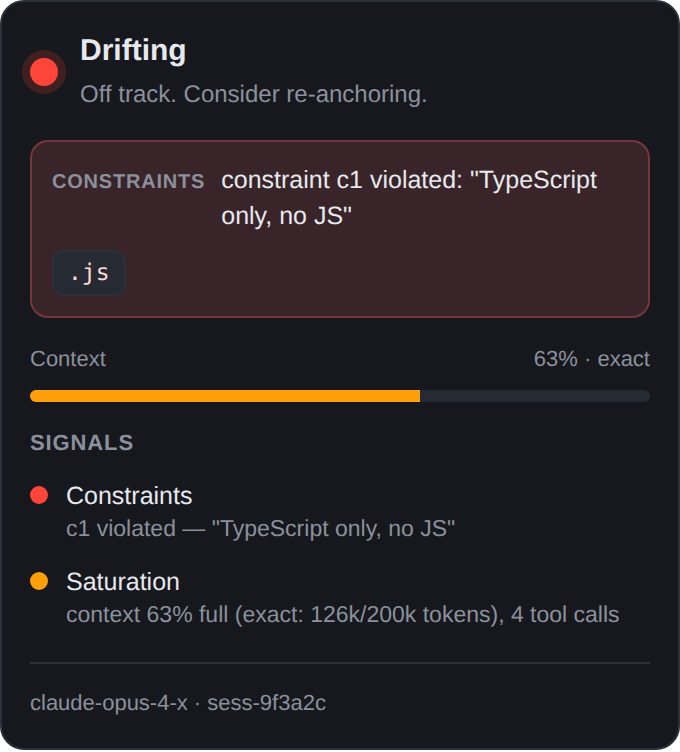
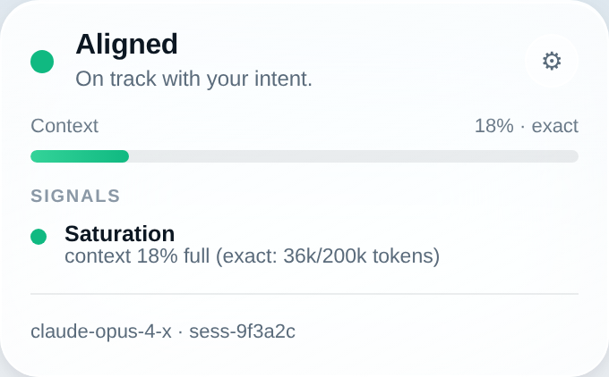
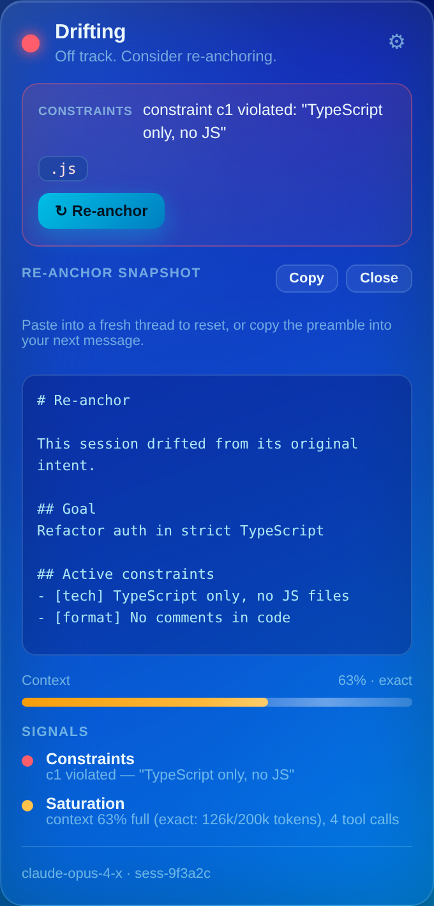

# Drifterr

> Your model didn't change. Your conversation did. Drifterr warns you before the wall.

Drifterr is a **local-first copilot** that watches whether your in-progress AI
chat session is *drifting* from what you originally asked — and warns you before
you lose an hour, with one-click re-anchoring.

The key insight that makes it solid: this is not a fuzzy perception. It's a
**measurable** deviation from a **ground truth the user owns** — the goal and
constraints *they themselves set*. We never claim "the model got worse"
(perceptual, unverifiable). We detect "this session diverged from what you set"
(measurable, verifiable).

See [`docs/BRIEF.md`](docs/BRIEF.md) for the full strategic & technical brief.

---

## Where this repo is

This is the **foundation + hard-signal engine + proxy channel + menubar** —
milestones **M0**, **M1**, and **M2**. The detection core is validated against
hand-annotated fixtures, the local API proxy feeds it real sessions with
**exact** saturation and byte-for-byte streaming passthrough, and the menubar
panel renders the live state.

| Milestone | Status |
|---|---|
| **M0** — monorepo, SQLite schema, normalized format, tokenizer | ✅ done |
| **M1** — engine: baseline, Signal 1 (constraints), Signal 4 (saturation), state machine | ✅ done |
| **M2** — proxy channel (SSE passthrough + tee) + control API + menubar panel | ✅ done |
| M3a — intervention (re-anchor snapshot + preamble) | ✅ done |
| M3b — soft signals: goal alignment (2) + degradation (5) + local embeddings | ✅ done |
| M3c — decision coherence (3) + pluggable judge (OpenRouter) | ✅ done |
| M4 — file watcher (Claude Code) + browser extension channels | ✅ done |
| M5 — standing orders (the moat) + opt-in proxy auto-re-anchor | ✅ done |
| Packaging — proxy↔app fusion + installers + signing/update (release workflow) | ✅ wired · ⬜ first signed build |

  

## Architecture (the non-negotiable principle)

The engine is **channel-agnostic**. Every channel produces the same normalized
`Conversation`; the engine is written once and only ever sees that shape. Adding
a source = writing an adapter, never touching the engine. Everything is local.

```
Channels (proxy │ file │ browser)
        │  → normalized Conversation + ContextState
        ▼
   Detection engine
   Baseline → 5 signals (separate, with evidence) → state machine
        ▼
   UI  +  Intervention  +  Standing-orders learning
```

## Crates

| Crate | Responsibility |
|---|---|
| [`crates/engine`](crates/engine) | The channel-agnostic core: normalized format, baseline, signals, state machine. |
| [`crates/store`](crates/store) | Local SQLite persistence (load/persist a `Conversation`, baseline, signal events). |
| [`crates/proxy`](crates/proxy) | The local API proxy channel: transparent SSE relay + tee, per-provider parsing, and the control/status API. |
| [`crates/intervention`](crates/intervention) | Re-anchor: builds the paste-ready reset snapshot + in-thread preamble from the baseline (pure, no LLM). |
| [`crates/judge`](crates/judge) | Pluggable, fail-safe binary judge (OpenRouter / Stub / Disabled) + decision-coherence (Signal 3). |
| [`crates/adapters`](crates/adapters) | Channel adapters that emit the normalized format — the Claude Code file watcher (M4). |
| [`crates/embeddings`](crates/embeddings) | Pluggable local text embeddings (default: dependency-free feature-hashing) for the soft signals. |
| [`crates/tokenizer`](crates/tokenizer) | Provider-pluggable token estimation + model→context-window map. |
| `fixtures/` | Hand-annotated transcripts — the M1 validation set. |

| [`apps/desktop`](apps/desktop) | The menubar app: a shared no-build panel UI (`ui/`) + the Tauri 2 tray shell (`src-tauri/`). |

| [`apps/extension`](apps/extension) | The browser channel (MV3): reads the chat DOM on claude.ai/ChatGPT/Gemini and posts it to the proxy's `/ingest`. |

All three channels (proxy, file watcher, browser extension) feed the **same**
engine via the normalized format — `POST /ingest` (browser) and the file watcher
both end at the proxy's single `ingest` path.

## The proxy channel (M2)

Point your tool at the proxy; it relays every request to the real provider
**transparently** and runs detection off the response path. This is the only
channel with *exact* saturation — it sees the real `messages` array and the
provider's reported token usage.

```bash
cp .env.example .env               # optional: OpenRouter is already the default
cargo run -p drifterr-proxy        # proxy :8787, control + dashboard :8788

# Point your tool at the proxy with your OpenRouter key:
export OPENAI_BASE_URL=http://localhost:8787/v1
export OPENAI_API_KEY=sk-or-...
# Anthropic-style tools:
export ANTHROPIC_BASE_URL=http://localhost:8787

open http://localhost:8788/        # the live menubar panel in any browser
curl http://localhost:8788/status  # raw drift status as JSON
```

**Provider:** Drifterr standardizes on **OpenRouter** (OpenAI-compatible) — it's
the default `OPENAI_UPSTREAM`, so every model routes through it. Override via
`.env` / env vars for plain OpenAI or a local server.

Config via env (a `.env` is auto-loaded): `OPENAI_UPSTREAM`,
`ANTHROPIC_UPSTREAM`, `DRIFTERR_PROXY_ADDR`, `DRIFTERR_CONTROL_ADDR`,
`DRIFTERR_DB` (SQLite path; omit for in-memory). The control API exposes
`GET /config` with the effective settings.

### File channel (M4) — Claude Code sessions

Set `DRIFTERR_WATCH_DIR` to a directory of Claude Code `*.jsonl` sessions (e.g.
`~/.claude/projects/<project>`) and the proxy watches them live, reconstructing
the conversation and feeding **the same engine** via the normalized format — no
channel-specific branch. Saturation is `estimated` here (the file has no wire
payload). Both channels end at one `ingest` path, so a file session and a proxied
request light up the menubar identically.

### Re-anchor (M3a)

When a session drifts, `GET /reanchor` returns a **paste-ready reset snapshot**
(goal + active constraints + held/rejected decisions + state) and a short
**in-thread preamble** that re-states the binding constraints. Both are pure
functions of the baseline — no LLM, no network. The menubar's **Re-anchor**
button renders and copies them.

**Opt-in auto-re-anchor (M5).** With `DRIFTERR_AUTO_REANCHOR=1`, the proxy
injects that preamble into the *next outgoing request* whenever the session is
RED — closing the loop automatically. It's off by default (it modifies what you
send), idempotent (never injected twice), and only fires on a hard RED.

**The #1 hard point, handled.** The upstream byte stream is forwarded to the
client unchanged while a cheap tee (refcounted `Bytes`) feeds a background task
that reconstructs the assistant turn and runs the engine. Added client latency
≈ 0. The e2e test asserts the relayed body is **byte-for-byte identical** to the
upstream's, for both OpenAI and Anthropic SSE — see
[`crates/proxy/tests/proxy_e2e.rs`](crates/proxy/tests/proxy_e2e.rs).

## The hard signals (what's implemented)

Signals are **never fused into one opaque score**. Each carries its own state
*and its own evidence* (turn index, constraint id, offending span), so the UI
can **name** the cause.

- **Signal 1 — constraint adherence.** Deterministic rules/regex on the latest
  assistant turn. 0 cost, 0 false positives. Allowed to drive RED on its own.
  Judge-checkable (fuzzy) constraints are deferred to a later milestone.
- **Signal 4 — context saturation.** Occupancy + per-turn fill rate + tool
  volume. Exact via the proxy, estimated elsewhere (we never lie about
  precision — see `ContextState::exact`). The leading indicator.

### Soft signals (support only — never RED alone)

- **Signal 2 — goal alignment.** Tracks the *trend* of cosine similarity between
  the goal and recent replies (local embeddings); fires AMBER when replies drift
  away. Reports on decline, not an absolute score, and needs several turns.
- **Signal 5 — degradation.** Cheap text stats: looping (near-duplicate
  replies), verbosity blow-ups, hedging spikes.

- **Signal 3 — decision coherence (judge-backed).** Catches the assistant
  reintroducing a decision the user explicitly *rejected*. Rejected decisions are
  captured deterministically ("don't use X"); retrieval is local (embedding
  cosine) and the final yes/no is the **judge's**, on the single best candidate —
  at most one model call per turn, only when something looks close.

All three **cap at AMBER by construction**, so a soft/judge signal can never
drive RED on its own — verified by a guardrail test. Embeddings are local and
deterministic (zero cost, zero network); a real ONNX model can slot in behind
the `Embedder` trait later.

### Standing orders — the moat (M5)

Constraints the user repeats across sessions are tracked (deduped by embedding
similarity) in the local store. At **≥3 occurrences** a constraint becomes a
**promotion candidate** (`GET /standing-orders`). Once **promoted**
(`POST /standing-orders/promote`), it's auto-applied as a constraint to every
**new** session's baseline — so an accepted rule reappears without the user
restating it. The whole loop (recur → candidate → promote → reappears) is
covered by an e2e test.

### The judge

Fuzzy checks go through a pluggable, **fail-safe** judge (`crates/judge`): any
error or unparseable reply yields *no violation*, and with no API key the judge
is simply disabled (everything else still works). It uses the user's own
provider — **OpenRouter** by default (`OPENROUTER_API_KEY`,
`DRIFTERR_JUDGE_MODEL`). Tests use a `Stub` judge, so CI never hits the network.

The **state machine** applies the brief's two rules: hard constraint violations
commit to RED immediately (they're facts), while threshold-based saturation
uses **hysteresis** (N consecutive confirmations up, N consecutive clears down)
to kill flicker.

A deliberate design choice worth flagging: a code-scoped rule (e.g. "no
comments") only fires inside fenced code blocks. If a message has no fences we
report *no violation* rather than guess that prose is code — a hard signal that
cries wolf is worse than one that stays quiet.

## Run it

```bash
cargo test                                   # all unit + fixture tests
cargo run -p drifterr-store --example demo   # end-to-end: detect → persist → reload
```

The demo builds a session that introduces an `auth.js` file against a
"TypeScript only" constraint and prints:

```
committed state: Red
triggered by Constraint: constraint c1 violated: "TypeScript only, no JS"
offending span: ".js"
```

## Acceptance, met

- **M0** — a `Conversation` loads from a JSON fixture and persists/reloads
  losslessly (`crates/store` round-trip tests).
- **M1** — on annotated transcripts the engine correctly flags deterministic
  constraint violations and saturation thresholds, with no real channel
  (`crates/engine/tests/fixtures.rs`).
- **M2** — a request relayed through the proxy streams back without degradation
  (byte-exact), and the control API turns red when a constraint is violated in a
  live session, with exact saturation (`crates/proxy/tests/proxy_e2e.rs`). The
  menubar panel renders that status correctly — state color, named triggering
  signal, offending span, offline handling — verified in headless Chromium
  (`apps/desktop/ui/tests/menubar.test.mjs`).
